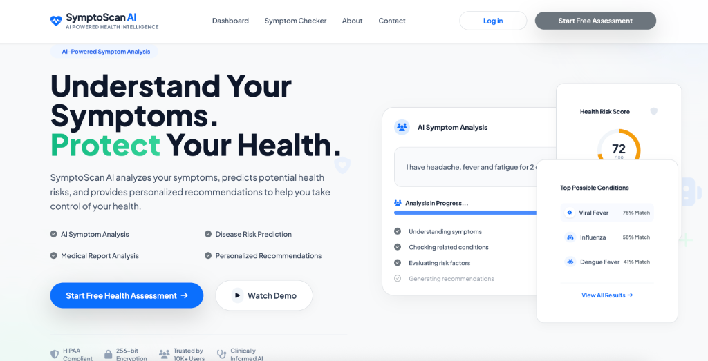

<div align="center">
  <h1>SymptoScan AI 🏥✨</h1>
  <p><strong>AI-Powered Health Intelligence & Disease Risk Prediction Platform</strong></p>
</div>

SymptoScan AI is a modern, comprehensive healthcare application designed to empower users with personalized health insights. Built with a beautiful glassmorphism UI, it uses advanced heuristics and machine learning algorithms to evaluate symptoms, predict disease risks, and analyze medical reports.



## 🚀 Key Features

*   **Intelligent Symptom Checker**: An interactive, category-based body explorer to input symptoms and receive instant AI-driven guidance.
*   **Disease Risk Assessment Wizards**: Beautiful, multi-step health screenings for 5 major categories:
    *   🫀 **Cardiovascular Health**
    *   🩸 **Metabolic Health** (Diabetes)
    *   🫘 **Kidney Health**
    *   🧬 **Liver Health**
    *   🫁 **Respiratory Health**
*   **Comprehensive Dashboards**: Visualize your health data with dynamic gauge charts, trend analysis, and personalized action plans.
*   **AI Medical Report Analysis**: Upload medical documents and let the AI extract and summarize key diagnostic information.
*   **Virtual AI Assistant**: A built-in chat interface for real-time health-related queries and follow-ups.

## 🛠️ Technology Stack

*   **Backend**: Python, Flask
*   **Frontend**: HTML5, Vanilla JS, Tailwind CSS
*   **UI/UX**: Premium Healthcare UI (Glassmorphism, Micro-animations)
*   **Charts**: Chart.js

## 🚦 Getting Started

Follow these steps to run SymptoScan AI locally on your machine.

### Prerequisites
* Python 3.8+
* pip (Python package installer)

### Installation

1. **Clone the repository:**
   ```bash
   git clone https://github.com/Ankit2006Raj/SymptoScan-AI.git
   cd SymptoScan-AI
   ```

2. **Create and activate a virtual environment:**
   ```bash
   python3 -m venv venv
   source venv/bin/activate  # On Windows use: venv\Scripts\activate
   ```

3. **Install the dependencies:**
   ```bash
   pip install -r requirements.txt
   ```

4. **Run the application:**
   ```bash
   python app.py
   ```

5. **Open your browser:**
   Navigate to `http://127.0.0.1:5001` to access the platform.

---
<div align="center">
  <i>Developed to make proactive healthcare accessible, understandable, and beautiful.</i>
</div>
