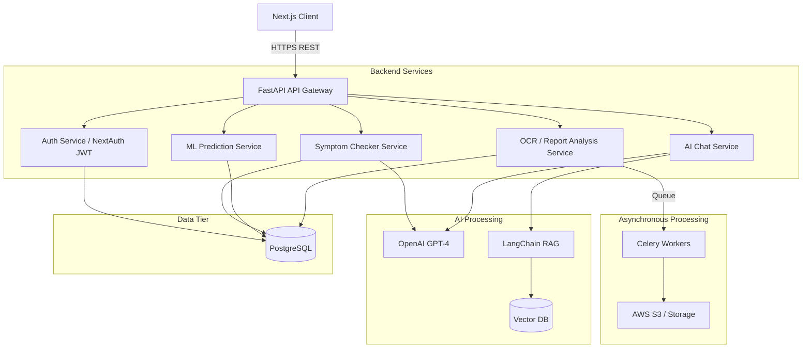

# System Architecture: SymptoScan AI

## High-Level Architecture Overview

SymptoScan AI utilizes a decoupled, modern web application architecture, separating the client-side presentation layer (Next.js) from the business logic and AI processing layer (FastAPI). 

### 1. Presentation Layer (Frontend)
- **Framework**: Next.js 15 (App Router).
- **Styling**: Tailwind CSS & Shadcn UI for premium aesthetics.
- **State Management**: TanStack Query (React Query) for server state caching and optimistic updates.
- **Role**: Handles user interactions, visualizes data, captures symptoms, and manages the chat interface. Connects to backend via REST APIs.

### 2. API & Business Logic Layer (Backend)
- **Framework**: FastAPI (Python 3.10+) for high-performance, asynchronous endpoints.
- **ORM**: SQLAlchemy for relational database mapping.
- **Task Queue**: Celery (with Redis broker) for asynchronous processing (e.g., PDF generation, ML model batch predictions, bulk OCR tasks).
- **Role**: Coordinates AI models, processes OCR requests, securely interacts with the database, and enforces business rules/RBAC.

### 3. Data Storage Layer
- **Relational DB**: PostgreSQL (hosted on Supabase) for transactional data (users, profiles, assessment history).
- **Vector DB**: pgvector (via Supabase) or Pinecone for storing text embeddings related to medical knowledge base RAG architecture.
- **Object Storage**: AWS S3 or Supabase Storage for storing uploaded medical reports (PDF/Images) securely.

### 4. AI & Machine Learning Layer
- **Layer 1 (Rule-Based Logic)**: Fast, deterministic triage for absolute contraindications and basic symptoms.
- **Layer 2 (ML Predictive Models)**: Random Forest / XGBoost models trained on Scikit-Learn for Diabetes, Heart Disease, Kidney, and Liver disease prediction. Served via FastAPI.
- **Layer 3 (LLM Reasoning)**: OpenAI API (GPT-4o) utilized for deep symptom analysis, conversational agent (AI Health Assistant), and personalized recommendation generation.
- **Layer 4 (RAG Architecture)**: LangChain orchestrating document retrieval against the vector database to ground LLM responses in factual medical contexts.
- **OCR Engine**: Tesseract OCR / PaddleOCR integrated via Celery workers for extracting text from medical reports.

## System Workflow Diagram (Mermaid)

## Security & Deployment
- **Authentication**: Stateless JWT tokens, HTTPS only.
- **Containerization**: Dockerized Next.js and FastAPI services.
- **CI/CD**: GitHub Actions for automated testing and deployment.
- **Infrastructure**: Vercel for Edge Network frontend delivery; Railway/Render for scalable backend compute.
