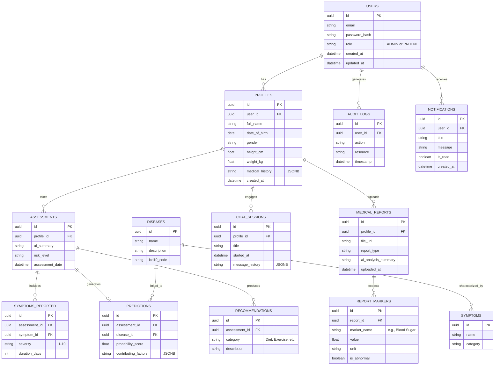

# Database Schema: SymptoScan AI

## Entity Relationship Diagram (Mermaid)

## Schema Details
- **PostgreSQL** is the primary database.
- Extensive use of `uuid` for primary keys to ensure global uniqueness and prevent enumeration attacks.
- Use of `JSONB` for flexible storage (e.g., `medical_history`, `message_history`, `contributing_factors`) where schemas might evolve without needing structural migrations.
- **pgvector** extension will be used alongside this schema to store embeddings for AI retrieval, potentially linked via `document_id` references.
